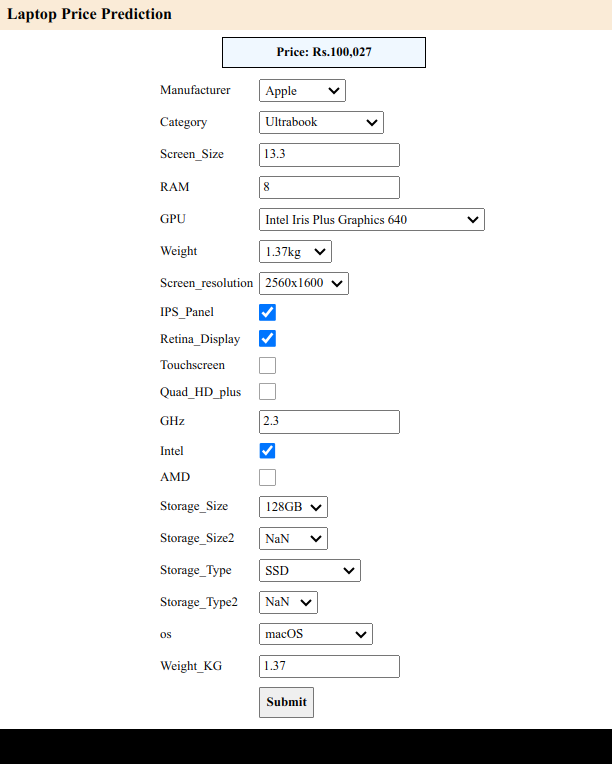

# Laptop Price Prediction

[Kaggle Dataset Link](https://www.kaggle.com/datasets/aemyjutt/laptop-price-analysis)

[Docker image](https://hub.docker.com/r/adhiban/laptop_price_prediction)

*If you run `app.py` in ubuntu or Windows, it may not work well. Because I use alpine to build Machine Learning Model. So run `train.py` to build ML Model for Ubuntu or Windows and run `app.py`*